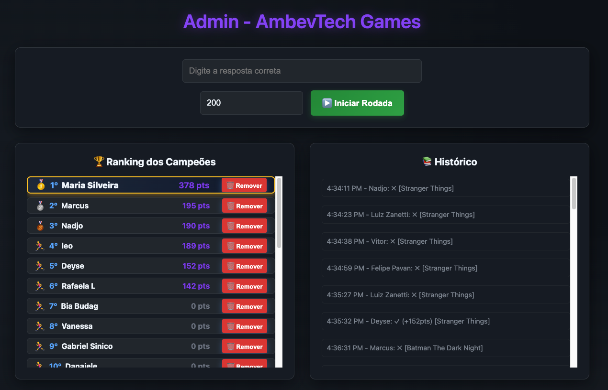
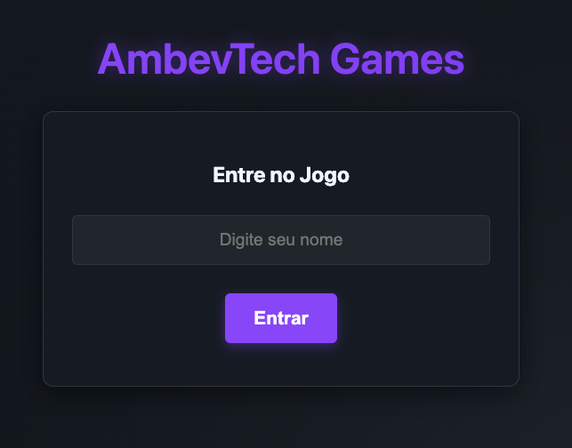
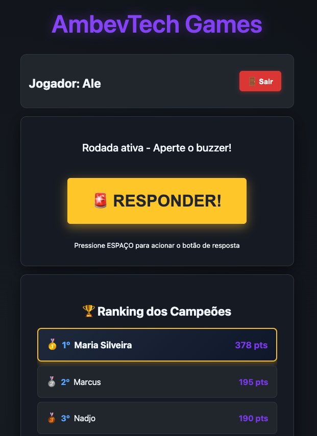
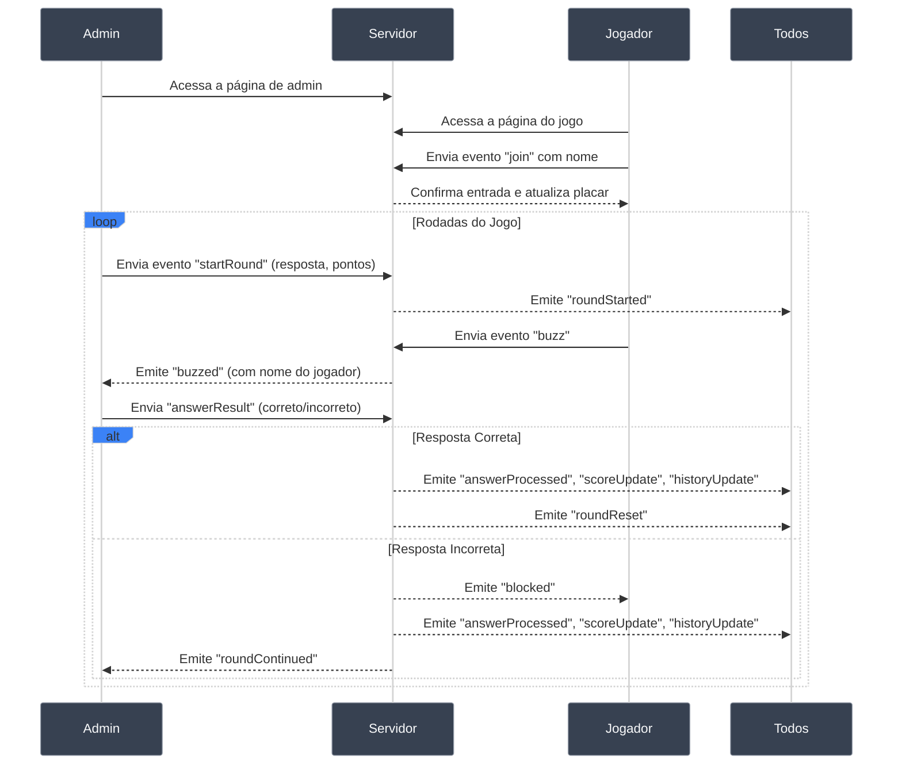
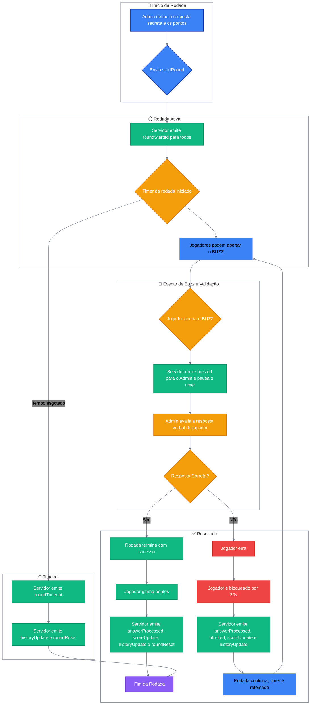

## Buzz Game - Plataforma para Jogos Interativos

### 1. Como Funciona (Para Todos)

Esta é uma plataforma flexível para criar jogos de quiz e competição em tempo real. A ideia é simples: uma pessoa (o **Admin**) apresenta um desafio, e os outros (**Jogadores**) competem para responder primeiro. O sistema cuida do tempo, da ordem de quem aperta o "buzz" e da pontuação.

A beleza está na versatilidade. O "desafio" pode ser qualquer coisa que você consiga apresentar para os jogadores, seja compartilhando sua tela, lendo uma pergunta em voz alta ou mostrando um vídeo.

#### Exemplo de Jogo: "Adivinhe o Filme pela Cena"

Implementamos esta dinâmica com grande sucesso:

- **Preparação:** O admin criou uma apresentação com frames de filmes e séries famosas.
- **Execução:** Durante videochamada, compartilhou a tela e rodou uma rodada de 20 segundos para cada slide.
- **Mecânica:** A "resposta secreta" era o nome do filme/série. Jogadores viam a imagem e competiam pelo buzz.
- **Resultado:** Diversão garantida e engajamento total da equipe!

#### Para o Administrador (Host)

- **Controle total:** Gerencie rodadas através do painel administrativo - inicie, pause e encerre quando necessário.
- **Configure desafios:** Defina a "resposta secreta" e a pontuação máxima para cada rodada. O desafio em si (imagem, pergunta, vídeo) você apresenta externamente.
- **Valide respostas:** Receba notificações instantâneas quando alguém der buzz e marque simplesmente "Correto" ou "Incorreto".
- **Monitore tudo:** Acompanhe placar em tempo real, histórico completo e gerencie participantes.

#### Para os Jogadores

- **Acesso simples:** Entre no jogo informando apenas seu nome e aguarde o início dos desafios.

- **Seja rápido:** Quando a rodada começar, o primeiro a apertar "BUZZ" ganha a chance de responder.
- **Ganhe pontos:** Acerte para pontuar baseado na sua velocidade. Erre e fique bloqueado por 30 segundos.
- **Acompanhe a disputa:** Veja o placar atualizado e o histórico completo das rodadas em tempo real.

### 2. Visão Geral Técnica

Sistema de quiz em tempo real desenvolvido com Node.js, Express e Socket.IO. O administrador gerencia as rodadas enquanto os participantes competem para responder primeiro, com pontuação baseada na velocidade de resposta.

### 3. Infraestrutura

- **Backend:** Node.js com Express para o servidor web e Socket.IO para comunicação em tempo real.
- **Frontend:** HTML, CSS e JavaScript puro, com páginas separadas para jogadores e para o administrador.
- **Deployment:** Containerizável com Docker.
- **Namespaces Socket.IO:**
  - `/admin`: Canal de comunicação exclusivo para o administrador.
  - `/game`: Canal de comunicação para todos os jogadores.

### 4. Fluxo de Jogo

1.  **Entrada:** Participantes acessam o jogo e informam seus nomes.
2.  **Início da Rodada:** O admin define a "resposta secreta" e a "pontuação máxima", iniciando o timer.
3.  **Buzz:** O primeiro jogador a pressionar "BUZZ" ganha a chance de responder. O timer pausa automaticamente.
4.  **Validação:** O admin escuta a resposta (verbal ou por outro meio) e marca como correta ou incorreta.
    - **Acerto:** O jogador ganha pontos, a rodada termina e a resposta é revelada.
    - **Erro:** O jogador fica bloqueado por 30 segundos, a rodada continua para os demais.
5.  **Final da Rodada:** Termina quando alguém acerta, o tempo esgota ou o admin cancela manualmente.
6.  **Acompanhamento:** Histórico completo e placar atualizado em tempo real para todos.

### 5. Diagramas de Fluxo

Os diagramas a seguir mostram como funciona a comunicação entre os componentes e a lógica das rodadas.

#### Fluxo de Comunicação (Sequence Diagram)

#### Lógica de uma Rodada (Flowchart)

### 6. Eventos & Payloads do Socket.IO

| Evento            | Origem   | Destino   | Payload                                                | Descrição                                                                                               |
| ----------------- | -------- | --------- | ------------------------------------------------------ | ------------------------------------------------------------------------------------------------------- |
| `join`            | Jogador  | Servidor  | `{ name }`                                             | Registra um novo jogador no sistema.                                                                    |
| `startRound`      | Admin    | Servidor  | `{ secretAnswer, maxPoints }`                          | Inicia uma nova rodada com os parâmetros definidos.                                                     |
| `roundStarted`    | Servidor | Todos     | `{ secret, maxPoints }` (admin) ou `{}` (jogador)      | Notifica que a rodada começou e o buzz está liberado.                                                   |
| `buzz`            | Jogador  | Servidor  | -                                                      | Sinaliza que o jogador apertou o buzz.                                                                  |
| `buzzed`          | Servidor | Admin     | `{ name, playerId }`                                   | Informa ao admin qual jogador deu o buzz.                                                               |
| `answerResult`    | Admin    | Servidor  | `{ playerId, correct }`                                | Admin informa se a resposta do jogador foi correta ou não.                                              |
| `answerProcessed` | Servidor | Jogadores | `{ correct, playerName, points, secret? }`             | Notifica os jogadores sobre o resultado da resposta. A resposta secreta só é enviada em caso de acerto. |
| `blocked`         | Servidor | Jogador   | `{ duration, startTime }`                              | Bloqueia o buzzer de um jogador por 30 segundos após um erro.                                           |
| `unblocked`       | Servidor | Jogador   | -                                                      | Notifica um jogador que seu período de bloqueio terminou.                                               |
| `scoreUpdate`     | Servidor | Todos     | `[{ name, score, blocked?, blockedTime?, playerId? }]` | Envia a lista atualizada de jogadores e pontuações. Dados extras apenas para o admin.                   |
| `historyUpdate`   | Servidor | Todos     | `[{ playerName, correct, points, secret, ... }]`       | Envia o histórico atualizado das rodadas.                                                               |
| `roundTimer`      | Servidor | Admin     | `{ remaining }`                                        | Envia o tempo restante da rodada para o admin.                                                          |
| `roundTimeout`    | Servidor | Todos     | -                                                      | Informa que a rodada terminou por tempo esgotado.                                                       |
| `roundReset`      | Servidor | Todos     | -                                                      | Sinaliza o fim da rodada, resetando a interface dos jogadores.                                          |
| `cancelRound`     | Admin    | Servidor  | -                                                      | Solicita o cancelamento da rodada atual.                                                                |
| `removePlayer`    | Admin    | Servidor  | `{ playerId }`                                         | Remove um jogador do jogo.                                                                              |
| `forceLogout`     | Servidor | Jogador   | -                                                      | Desconecta um jogador do jogo (usado após `removePlayer`).                                              |

### 7. Regras de Pontuação e Bloqueio

- **Cálculo de Pontos:** `Pontos = Máximo - SegundosDecorridos`. Quanto mais rápido, maior a pontuação.
- **Bloqueio por Erro:** Jogador que erra fica 30 segundos sem poder usar o buzz, dando oportunidade aos demais.
- **Privacidade:** A resposta secreta só é revelada ao final da rodada, e apenas se alguém acertar.

### 8. Setup e Deploy

#### Opção 1: Usando Docker (Localmente)

1.  Clone o repositório.
2.  Construa a imagem Docker: `docker build -t buzz-game .`
3.  Execute o container: `docker run -d -p 3000:3000 buzz-game`
4.  Acesse a aplicação:
    - **Admin:** `http://localhost:3000/admin.html`
    - **Jogadores:** `http://localhost:3000/index.html`

#### Opção 2: Deploy Gratuito com Glitch

Alternativa simples para testar e hospedar online gratuitamente:

1.  **Fork:** Crie um fork deste repositório na sua conta GitHub.
2.  **Importe:** Acesse [glitch.com](https://glitch.com), crie novo projeto e escolha "Import from GitHub".
3.  **Deploy:** O Glitch instala dependências e inicia automaticamente. Você recebe uma URL pública.
4.  **Acesso:**
    - **Admin:** `https://seu-projeto.glitch.me/admin.html`
    - **Jogadores:** `https://seu-projeto.glitch.me/index.html`
