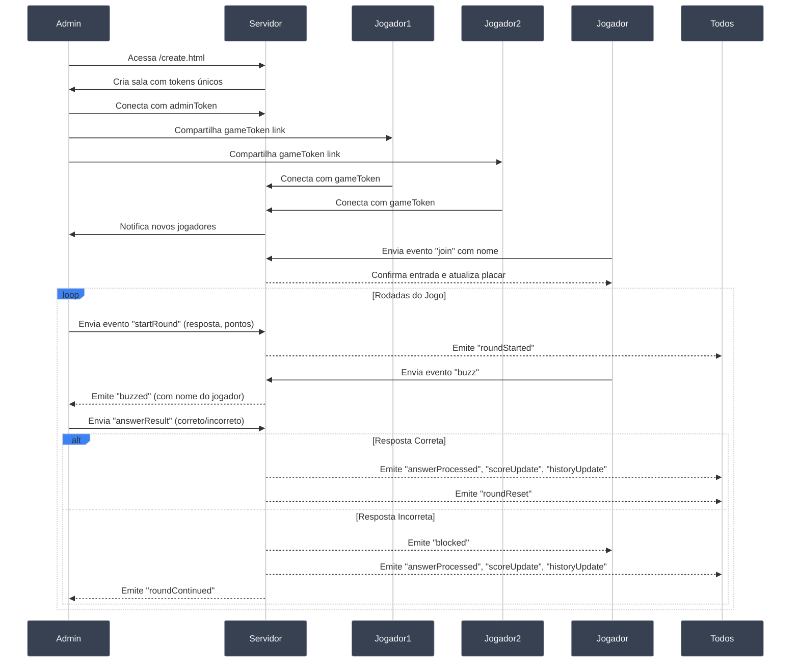
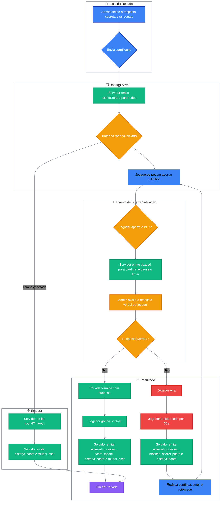

## Buzz Game - Plataforma Multi-Tenant para Jogos Interativos

### 1. Como Funciona (Para Todos)

Esta é uma plataforma flexível para criar jogos de quiz e competição em tempo real. A ideia é simples: um **Admin** cria uma sala privada, apresenta desafios, e os **Jogadores** competem para responder primeiro usando links seguros e únicos. O sistema cuida do tempo, da ordem de quem aperta o "buzz", da pontuação e da segregação entre salas.

A beleza está na versatilidade e segurança. Cada sala é completamente isolada, com seus próprios links de acesso. O "desafio" pode ser qualquer coisa que você consiga apresentar para os jogadores, seja compartilhando sua tela, lendo uma pergunta em voz alta ou mostrando um vídeo.

#### Exemplo de Jogo: "Adivinhe o Filme pela Cena"

Implementamos esta dinâmica com grande sucesso:

- **Criação:** O admin acessa `/create.html` e cria uma nova sala, recebendo links únicos.
- **Preparação:** O admin criou uma apresentação com frames de filmes e séries famosas.
- **Execução:** Durante videochamada, compartilhou o link dos jogadores e rodou rodadas de 20 segundos para cada slide.
- **Mecânica:** A "resposta secreta" era o nome do filme/série. Jogadores viam a imagem e competiam pelo buzz.
- **Resultado:** Diversão garantida e engajamento total da equipe, com total segurança e privacidade!

#### Para o Administrador (Host)

- **Criação segura:** Acesse `/create.html` para criar uma nova sala e receber links únicos de admin e jogadores.
- **Controle total:** Gerencie rodadas através do painel administrativo - inicie, pause e encerre quando necessário.
- **Configure desafios:** Defina a "resposta secreta" e a pontuação máxima para cada rodada. O desafio em si (imagem, pergunta, vídeo) você apresenta externamente.
- **Valide respostas:** Receba notificações instantâneas quando alguém der buzz e marque simplesmente "Correto" ou "Incorreto".
- **Monitore tudo:** Acompanhe placar em tempo real, histórico completo e gerencie participantes.
- **Compartilhe links:** Copie facilmente o link dos jogadores para distribuir à sua equipe.

#### Para os Jogadores

- **Acesso via link:** Receba o link do jogo do administrador e entre informando apenas seu nome.
- **Sessão persistente:** Seu progresso é mantido mesmo se você sair e voltar usando o mesmo link personalizado.
- **Seja rápido:** Quando a rodada começar, o primeiro a apertar "BUZZ" ganha a chance de responder.
- **Ganhe pontos:** Acerte para pontuar baseado na sua velocidade. Erre e fique bloqueado por 30 segundos.
- **Acompanhe a disputa:** Veja o placar atualizado e o histórico completo das rodadas em tempo real.

### 2. Arquitetura Multi-Tenant

O sistema foi projetado para suportar múltiplas salas simultâneas e independentes:

- **Isolamento de salas:** Cada jogo possui tokens únicos para admin e jogadores, garantindo total segregação.
- **Segurança:** Apenas quem possui o link correto pode acessar uma sala específica.
- **Escalabilidade:** Suporte nativo para múltiplas salas simultâneas sem interferência.

### 3. Infraestrutura

- **Backend:** Node.js com Express para o servidor web e Socket.IO para comunicação em tempo real.
- **Frontend:** HTML, CSS e JavaScript puro, com páginas separadas para criação, jogadores e administrador.
- **Deployment:** Containerizável com Docker.
- **Sistema de Salas:** Arquitetura baseada em tokens seguros para isolamento total entre jogos.
- **Compatibilidade:** Suporta Node.js versão 10.x ou superior (compatível com Glitch.com e outras plataformas).

### 4. Como Usar

#### Passo a Passo Completo

1. **Criação da Sala**

   - Acesse `/create.html`
   - Clique em "Criar Jogo"
   - Você será redirecionado para o painel de admin com tokens únicos

2. **Configuração do Admin**

   - Na tela de admin, você verá dois links importantes:
     - **Link do Admin:** Para você acessar futuramente
     - **Link dos Jogadores:** Para compartilhar com sua equipe
   - Copie o link dos jogadores e envie para os participantes

3. **Entrada dos Jogadores**

   - Jogadores acessam o link fornecido
   - Informam seus nomes e entram automaticamente na sala

4. **Execução do Jogo**

   - **Admin:** Define a "resposta secreta" e "pontuação máxima", inicia a rodada
   - **Jogadores:** Competem para ser o primeiro a dar buzz
   - **Admin:** Avalia a resposta e marca como correta ou incorreta

5. **Persistência**
   - Links permanecem válidos durante toda a sessão
   - Jogadores podem sair e voltar mantendo sua pontuação
   - Admin pode fechar e reabrir o painel usando seu link

### 5. Fluxo de Jogo

1. **Criação:** Admin cria sala e recebe links únicos
2. **Distribuição:** Admin compartilha link dos jogadores
3. **Entrada:** Participantes acessam via link e informam nomes
4. **Início da Rodada:** Admin define resposta secreta e pontuação máxima
5. **Buzz:** Primeiro jogador a pressionar "BUZZ" ganha chance de responder
6. **Validação:** Admin escuta resposta e marca como correta/incorreta
   - **Acerto:** Jogador ganha pontos, rodada termina, resposta revelada
   - **Erro:** Jogador bloqueado 30s, rodada continua
7. **Final:** Termina quando alguém acerta, tempo esgota ou admin cancela
8. **Repetição:** Processo se repete para próximas rodadas

### 6. Diagramas de Fluxo

Os diagramas a seguir mostram como funciona a comunicação entre os componentes e a lógica das rodadas na arquitetura multi-tenant.

#### Fluxo de Comunicação Multi-Tenant

#### Lógica de uma Rodada (Flowchart)

### 7. Eventos & Payloads do Socket.IO

| Evento            | Origem   | Destino  | Payload                                                | Descrição                                                                                  |
| ----------------- | -------- | -------- | ------------------------------------------------------ | ------------------------------------------------------------------------------------------ |
| `admin-join`      | Admin    | Servidor | `{ adminToken }`                                       | Admin se conecta à sala usando token de administrador.                                     |
| `player-join`     | Jogador  | Servidor | `{ gameToken, name, playerId? }`                       | Jogador se conecta à sala usando token do jogo.                                            |
| `startRound`      | Admin    | Servidor | `{ secretAnswer, maxPoints }`                          | Inicia uma nova rodada com os parâmetros definidos.                                        |
| `roundStarted`    | Servidor | Sala     | `{ secret, maxPoints }` (admin) ou `{}` (jogador)      | Notifica que a rodada começou e o buzz está liberado.                                      |
| `buzz`            | Jogador  | Servidor | -                                                      | Sinaliza que o jogador apertou o buzz.                                                     |
| `buzzed`          | Servidor | Sala     | `{ name, playerId }`                                   | Informa qual jogador deu o buzz.                                                           |
| `answerResult`    | Admin    | Servidor | `{ playerId, correct }`                                | Admin informa se a resposta do jogador foi correta ou não.                                 |
| `answerProcessed` | Servidor | Sala     | `{ correct, playerName, points, secret? }`             | Notifica sobre o resultado da resposta. A resposta secreta só é enviada em caso de acerto. |
| `blocked`         | Servidor | Jogador  | `{ duration, startTime }`                              | Bloqueia o buzzer de um jogador por 30 segundos após um erro.                              |
| `unblocked`       | Servidor | Jogador  | -                                                      | Notifica um jogador que seu período de bloqueio terminou.                                  |
| `scoreUpdate`     | Servidor | Todos    | `[{ name, score, blocked?, blockedTime?, playerId? }]` | Envia a lista atualizada de jogadores e pontuações. Dados extras apenas para o admin.      |
| `historyUpdate`   | Servidor | Todos    | `[{ playerName, correct, points, secret, ... }]`       | Envia o histórico atualizado das rodadas.                                                  |
| `roundTimer`      | Servidor | Admin    | `{ remaining }`                                        | Envia o tempo restante da rodada para o admin.                                             |
| `roundTimeout`    | Servidor | Todos    | -                                                      | Informa que a rodada terminou por tempo esgotado.                                          |
| `roundReset`      | Servidor | Todos    | -                                                      | Sinaliza o fim da rodada, resetando a interface dos jogadores.                             |
| `cancelRound`     | Admin    | Servidor | -                                                      | Solicita o cancelamento da rodada atual.                                                   |
| `removePlayer`    | Admin    | Servidor | `{ playerId }`                                         | Remove um jogador do jogo.                                                                 |
| `forceLogout`     | Servidor | Jogador  | -                                                      | Desconecta um jogador do jogo (usado após `removePlayer`).                                 |

### 7. Regras de Pontuação e Bloqueio

- **Cálculo de Pontos:** `Pontos = Máximo - SegundosDecorridos`. Quanto mais rápido, maior a pontuação.
- **Bloqueio por Erro:** Jogador que erra fica 30 segundos sem poder usar o buzz, dando oportunidade aos demais.
- **Privacidade:** A resposta secreta só é revelada ao final da rodada, e apenas se alguém acertar.

### 8. Setup e Deploy

#### Opção 1: Usando Docker (Localmente)

1. Clone o repositório.
2. Construa a imagem Docker: `docker build -t buzz-game .`
3. Execute o container: `docker run -d -p 3000:3000 buzz-game`
4. Acesse a aplicação em `http://localhost:3000/create.html`

#### Opção 2: Deploy Gratuito com Glitch

Alternativa simples para testar e hospedar online gratuitamente:

1. **Fork:** Crie um fork deste repositório na sua conta GitHub.
2. **Importe:** Acesse [glitch.com](https://glitch.com), crie novo projeto e escolha "Import from GitHub".
3. **Deploy:** O Glitch instala dependências e inicia automaticamente. Você recebe uma URL pública.
4. **Acesso:** `https://seu-projeto.glitch.me/create.html`

#### Opção 3: Desenvolvimento Local

1. Clone o repositório
2. Instale dependências: `npm install`
3. Inicie o servidor: `npm start`
4. Acesse `http://localhost:3000/create.html`

### 9. Fluxo de URLs

- **`/create.html`** - Página inicial para criar novas salas
- **`/admin.html?token={adminToken}&game={gameToken}`** - Painel do administrador
- **`/index.html?game={gameToken}&id={playerId}`** - Interface dos jogadores

### 10. Segurança e Privacidade

- **Isolamento:** Cada sala é completamente isolada das demais
- **Tokens únicos:** Acesso controlado via tokens seguros gerados aleatoriamente
- **Sem persistência:** Dados armazenados apenas em memória durante a sessão
- **Validação:** Verificação de tokens em todas as operações críticas
