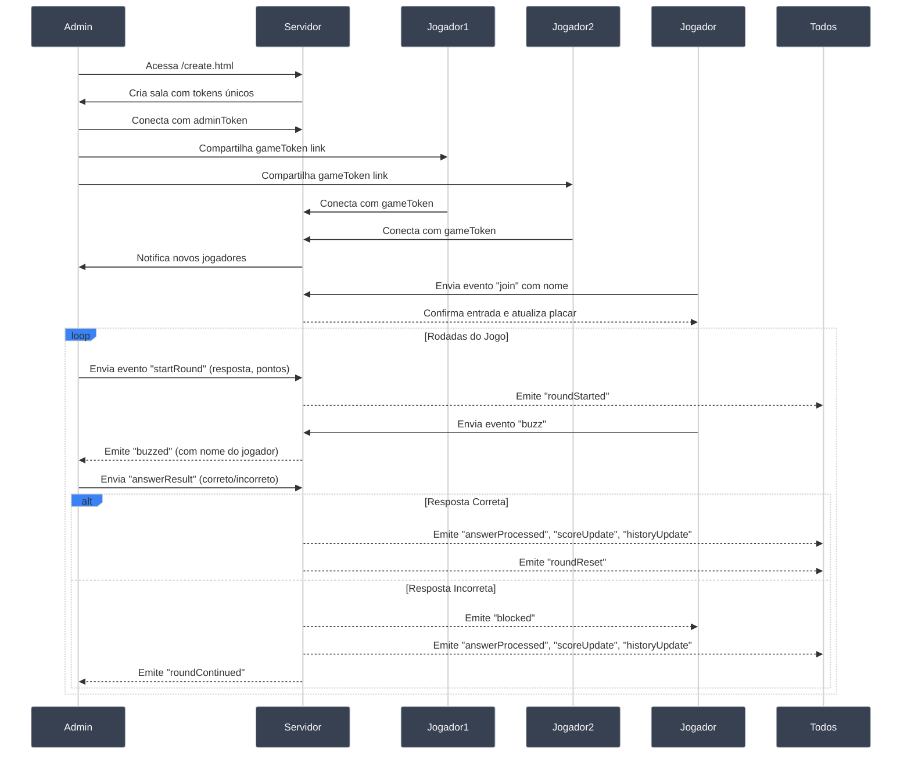
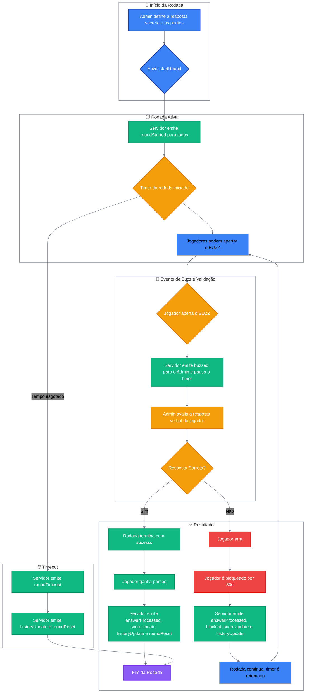

## Buzz Game - Plataforma Multi-Tenant para Jogos Interativos

### 1. Como Funciona

Esta é uma plataforma flexível para criar jogos de quiz e competição em tempo real. A ideia é simples: um **Admin** cria uma sala privada, apresenta desafios, e os **Jogadores** competem para responder primeiro usando links seguros e únicos. O sistema gerencia tempo, ordem de buzz, pontuação e isolamento entre salas.

A versatilidade está na flexibilidade: o "desafio" pode ser qualquer coisa que você apresente aos jogadores - seja compartilhando tela, lendo perguntas ou mostrando vídeos.

#### Exemplo Prático: "Adivinhe o Filme pela Cena"

Implementei esta dinâmica com sucesso para uma equipe:

- **Preparação:** Criei uma apresentação com frames de filmes e séries famosas
- **Setup:** Criei uma sala no `/create.html` e distribui o link dos jogadores via videochamada
- **Dinâmica:** Compartilhei tela mostrando cada frame por 20 segundos
- **Mecânica:** A "resposta secreta" era o nome do filme/série. Jogadores competiam pelo buzz
- **Resultado:** Engajamento total da equipe com total segurança e privacidade

### 2. Funcionalidades Principais

#### Para o Administrador

- **Criar salas personalizadas** com nome customizado e links únicos
- **Gerenciar rodadas** - iniciar, pausar, cancelar e encerrar
- **Definir desafios** com resposta secreta e pontuação máxima
- **Validar respostas** em tempo real - marcar como correto ou incorreto
- **Monitorar progresso** com placar ao vivo e histórico completo
- **Controlar participantes** - remover jogadores e encerrar sala
- **Compartilhar acesso** através de links seguros

#### Para os Jogadores

- **Entrar facilmente** usando link fornecido pelo admin
- **Manter progresso** mesmo saindo e retornando à sala
- **Responder rapidamente** com botão BUZZ ou tecla ESPAÇO
- **Ganhar pontos** baseados na velocidade de resposta
- **Acompanhar ranking** e histórico em tempo real
- **Sair voluntariamente** a qualquer momento

### 3. Arquitetura Multi-Tenant

- **Isolamento total:** Cada sala possui tokens únicos para admin e jogadores
- **Segurança:** Apenas quem possui o link correto pode acessar uma sala
- **Escalabilidade:** Suporte para múltiplas salas simultâneas sem interferência
- **Persistência:** Jogadores mantêm sessão mesmo com desconexões temporárias

### 4. Infraestrutura

- **Backend:** Node.js com Express para o servidor web e Socket.IO para comunicação em tempo real.
- **Frontend:** HTML, CSS e JavaScript puro, com páginas separadas para criação, jogadores e administrador.
- **Deployment:** Containerizável com Docker e Docker Compose para fácil deploy.
- **Sistema de Salas:** Arquitetura baseada em tokens seguros para isolamento total entre jogos.
- **Compatibilidade:** Suporta Node.js versão 18.x (compatível com plataformas modernas).
- **Dependências:** Express 4.18.2 e Socket.IO 4.6.1 para máxima estabilidade.

### 5. Como Usar

#### Guia Rápido

1. **Criar Sala:** Acesse `/create.html`, opcionalmente defina um nome, clique "Criar Jogo"
2. **Distribuir:** Copie e compartilhe o link dos jogadores
3. **Configurar:** Defina resposta secreta e pontuação máxima
4. **Jogar:** Inicie rodada, jogadores competem pelo buzz, valide respostas
5. **Repetir:** Continue com novas rodadas ou encerre a sala

### 6. Fluxo de uma Rodada

1. **Admin inicia:** Define resposta secreta e pontuação máxima
2. **Rodada ativa:** Jogadores podem dar buzz (botão ou ESPAÇO)
3. **Primeiro buzz:** Jogador ganha chance de responder
4. **Validação:** Admin marca como correto ou incorreto
   - **Acerto:** Jogador ganha pontos, rodada termina
   - **Erro:** Jogador bloqueado 30s, rodada continua
5. **Fim:** Alguém acerta, tempo esgota ou admin cancela

### 7. Regras e Pontuação

- **Cálculo:** Pontos = Máximo - Segundos Decorridos
- **Velocidade recompensada:** Quanto mais rápido, maior a pontuação
- **Bloqueio por erro:** 30 segundos sem poder dar buzz após resposta incorreta
- **Privacidade:** Resposta secreta só revelada quando alguém acerta

### 8. Diagramas Técnicos

#### Fluxo de Comunicação Multi-Tenant

#### Lógica de uma Rodada (Flowchart)

### 7. Eventos & Payloads do Socket.IO

| Evento            | Origem   | Destino  | Payload                                                | Descrição                                                                                  |
| ----------------- | -------- | -------- | ------------------------------------------------------ | ------------------------------------------------------------------------------------------ |
| `admin-join`      | Admin    | Servidor | `{ adminToken }`                                       | Admin se conecta à sala usando token de administrador.                                     |
| `player-join`     | Jogador  | Servidor | `{ gameToken, name, playerId? }`                       | Jogador se conecta à sala usando token do jogo.                                            |
| `startRound`      | Admin    | Servidor | `{ secretAnswer, maxPoints }`                          | Inicia uma nova rodada com os parâmetros definidos.                                        |
| `roundStarted`    | Servidor | Sala     | `{ secret, maxPoints }` (admin) ou `{}` (jogador)      | Notifica que a rodada começou e o buzz está liberado.                                      |
| `buzz`            | Jogador  | Servidor | -                                                      | Sinaliza que o jogador apertou o buzz.                                                     |
| `buzzed`          | Servidor | Sala     | `{ name, playerId }`                                   | Informa qual jogador deu o buzz.                                                           |
| `answerResult`    | Admin    | Servidor | `{ playerId, correct }`                                | Admin informa se a resposta do jogador foi correta ou não.                                 |
| `answerProcessed` | Servidor | Sala     | `{ correct, playerName, points, secret? }`             | Notifica sobre o resultado da resposta. A resposta secreta só é enviada em caso de acerto. |
| `blocked`         | Servidor | Jogador  | `{ duration, startTime }`                              | Bloqueia o buzzer de um jogador por 30 segundos após um erro.                              |
| `unblocked`       | Servidor | Jogador  | -                                                      | Notifica um jogador que seu período de bloqueio terminou.                                  |
| `scoreUpdate`     | Servidor | Todos    | `[{ name, score, blocked?, blockedTime?, playerId? }]` | Envia a lista atualizada de jogadores e pontuações. Dados extras apenas para o admin.      |
| `historyUpdate`   | Servidor | Todos    | `[{ playerName, correct, points, secret, ... }]`       | Envia o histórico atualizado das rodadas.                                                  |
| `roundTimer`      | Servidor | Admin    | `{ remaining }`                                        | Envia o tempo restante da rodada para o admin.                                             |
| `roundTimeout`    | Servidor | Todos    | -                                                      | Informa que a rodada terminou por tempo esgotado.                                          |
| `roundReset`      | Servidor | Todos    | -                                                      | Sinaliza o fim da rodada, resetando a interface dos jogadores.                             |
| `cancelRound`     | Admin    | Servidor | -                                                      | Solicita o cancelamento da rodada atual.                                                   |
| `removePlayer`    | Admin    | Servidor | `{ playerId }`                                         | Remove um jogador do jogo.                                                                 |
| `endGame`         | Admin    | Servidor | -                                                      | Encerra completamente a sala e desconecta todos os jogadores.                              |
| `gameEnded`       | Servidor | Jogador  | `{ message }`                                          | Notifica um jogador que o jogo foi encerrado pelo administrador.                           |
| `logout`          | Jogador  | Servidor | -                                                      | Jogador solicita sair voluntariamente do jogo.                                             |
| `getPlayerInfo`   | Cliente  | Servidor | `{ playerId, gameToken }`                              | Solicita informações de um jogador específico (usado para reconexão).                      |
| `playerInfo`      | Servidor | Cliente  | `{ name }`                                             | Retorna informações de um jogador (resposta para `getPlayerInfo`).                         |
| `forceLogout`     | Servidor | Jogador  | -                                                      | Desconecta um jogador do jogo (usado após `removePlayer`).                                 |

### 9. Controles e Interação

#### Controles de Teclado

- **Tecla ESPAÇO:** Os jogadores podem usar a tecla ESPAÇO como alternativa ao botão "BUZZ" para responder mais rapidamente
- **Enter:** Funciona para criar sala na tela inicial e confirmar nome do jogador

#### Interface Responsiva

- **Design adaptativo:** Funciona perfeitamente em desktop, tablet e mobile
- **Botões otimizados:** Tamanhos adequados para touch em dispositivos móveis
- **Cores neutras:** Interface com esquema de cores escuro e elegante para reduzir fadiga visual

### 10. Setup e Deploy

#### Opção 1: Usando Docker Compose (Recomendado)

1. Clone o repositório.
2. Execute: `docker-compose up -d`
3. A aplicação estará disponível em `http://localhost:3333/create.html`

#### Opção 2: Usando Docker (Localmente)

1. Clone o repositório.
2. Construa a imagem Docker: `docker build -t buzz-game .`
3. Execute o container: `docker run -d -p 3000:3000 buzz-game`
4. Acesse a aplicação em `http://localhost:3000/create.html`

#### Opção 3: Deploy Gratuito com Glitch

Alternativa simples para testar e hospedar online gratuitamente:

1. **Fork:** Crie um fork deste repositório na sua conta GitHub.
2. **Importe:** Acesse [glitch.com](https://glitch.com), crie novo projeto e escolha "Import from GitHub".
3. **Deploy:** O Glitch instala dependências e inicia automaticamente. Você recebe uma URL pública.
4. **Acesso:** `https://seu-projeto.glitch.me/create.html`

#### Opção 4: Desenvolvimento Local

1. Clone o repositório
2. Instale dependências: `npm install`
3. Inicie o servidor: `npm start`
4. Acesse `http://localhost:3000/create.html`

### 11. Fluxo de URLs

- **`/create.html`** - Página inicial para criar novas salas
- **`/admin.html?token={adminToken}&game={gameToken}`** - Painel do administrador
- **`/index.html?game={gameToken}&id={playerId}`** - Interface dos jogadores

### 12. Segurança e Privacidade

- **Isolamento:** Cada sala é completamente isolada das demais
- **Tokens únicos:** Acesso controlado via tokens seguros gerados aleatoriamente
- **Sem persistência:** Dados armazenados apenas em memória durante a sessão
- **Validação:** Verificação de tokens em todas as operações críticas
