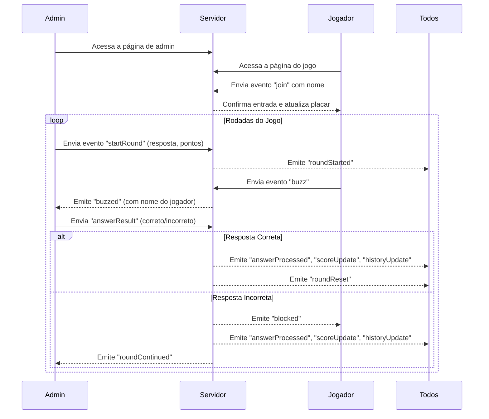
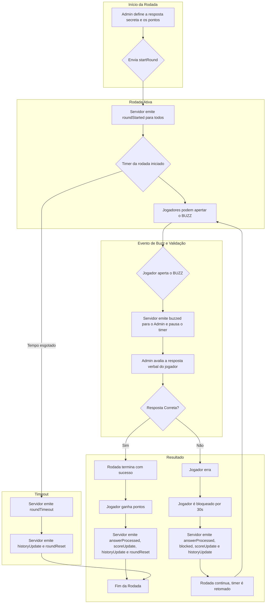

## Buzz Game - Plataforma para Jogos Interativos

### 1. Como Funciona (Para Todos)

Esta é uma plataforma flexível para criar jogos de quiz e competição em tempo real. A ideia é simples: uma pessoa (o **Admin**) apresenta um desafio, e os outros (**Jogadores**) competem para responder primeiro. O sistema cuida do tempo, da ordem de quem aperta o "buzz" e da pontuação.

A beleza está na versatilidade. O "desafio" pode ser qualquer coisa que você consiga apresentar para os jogadores, seja compartilhando sua tela, lendo uma pergunta em voz alta ou mostrando um vídeo.

#### Exemplo de Jogo: "Adivinhe o Filme pela Cena"

Uma maneira divertida que usamos foi a seguinte:

- O **Admin** preparou uma apresentação de slides. Cada slide continha uma imagem (frame) de um filme ou série famosa.
- Durante uma chamada de vídeo, o Admin compartilhava a tela e iniciava uma rodada no Buzz Game para cada slide, com duração de 20 segundos.
- A "resposta secreta" no sistema era o nome do filme.
- Os **Jogadores** viam a imagem e corriam para apertar o "BUZZ". O primeiro a apertar dava seu palpite.
- O **Admin** validava a resposta, e o jogo seguia para o próximo slide/rodada. Foi super divertido!

#### Para o Administrador (Host)

- **Você comanda o jogo:** Através de uma página de admin, você inicia, pausa e encerra as rodadas.
- **Prepare o desafio:** Para cada rodada, você define a "resposta secreta" no sistema (ex: "De Volta para o Futuro") e quantos pontos a rodada vale. O desafio em si (a imagem, a pergunta, etc.) você apresenta por fora (ex: compartilhando a tela).
- **Valide as respostas:** Quando um jogador aperta o "BUZZ", você é notificado. O jogador responde verbalmente, e você simplesmente clica em "Correto" ou "Incorreto" no painel.
- **Controle total:** Você acompanha o placar, o histórico de todas as rodadas e pode até remover um jogador, se necessário.

#### Para os Jogadores

- **Entre e jogue:** Você acessa a página do jogo, digita seu nome e espera o desafio ser apresentado.

- **Seja rápido no gatilho:** Assim que o admin iniciar a rodada, o botão "BUZZ" ficará disponível. O primeiro a apertar ganha a chance de responder.
- **Responda e marque pontos:** Se acertar, você ganha pontos baseados na sua velocidade. Se errar, fica bloqueado por 30 segundos sem poder dar um novo buzz.
- **Acompanhe a competição:** O placar e o histórico de quem acertou, errou ou deixou o tempo acabar são visíveis para todos.

### 2. Visão Geral Técnica

Uma aplicação de quiz em tempo real projetada para engajamento de equipes remotas. O administrador (host) controla as rodadas, definindo uma resposta e uma pontuação máxima. Os participantes competem para dar "buzz" e responder primeiro, com a pontuação sendo calculada com base na velocidade da resposta.

### 3. Infraestrutura

- **Backend:** Node.js com Express para o servidor web e Socket.IO para comunicação em tempo real.
- **Frontend:** HTML, CSS e JavaScript puro, com páginas separadas para jogadores e para o administrador.
- **Deployment:** Containerizável com Docker.
- **Namespaces Socket.IO:**
  - `/admin`: Canal de comunicação exclusivo para o administrador.
  - `/game`: Canal de comunicação para todos os jogadores.

### 4. Fluxo de Jogo

1.  **Entrar no Jogo:** Um participante entra no jogo fornecendo um nome de usuário.
2.  **Iniciar Rodada:** O admin inicia uma nova rodada, definindo a "resposta secreta" e a "pontuação máxima". Um timer regressivo começa para todos os jogadores.
3.  **Buzz:** O primeiro jogador a pressionar o botão "BUZZ" tem a chance de responder. O timer da rodada é pausado e o botão de buzz é desabilitado para todos os outros.
4.  **Validação do Admin:** O admin recebe a notificação de quem deu o buzz e deve validar a resposta (que é dada verbalmente ou por outro meio externo ao sistema).
    - **Resposta Correta:** O admin clica em "Correto". O jogador recebe pontos, a rodada termina, o placar é atualizado e a resposta correta é revelada a todos.
    - **Resposta Incorreta:** O admin clica em "Incorreto". O jogador não ganha pontos e fica bloqueado por 30 segundos, não podendo dar buzz novamente nesse período. A rodada continua, o timer é retomado e os outros jogadores podem dar buzz.
5.  **Fim da Rodada:** Uma rodada pode terminar de três maneiras:
    - Um jogador acerta a resposta.
    - O tempo da rodada se esgota (`timeout`).
    - O admin cancela a rodada manualmente.
6.  **Histórico e Placar:** Todas as ações (acertos, erros, timeouts) são registradas no histórico, visível para todos. O placar é atualizado em tempo real.

### 5. Diagramas de Fluxo

Para uma visão mais visual, os diagramas abaixo ilustram o fluxo de comunicação e a lógica das rodadas.

#### Fluxo de Comunicação (Sequence Diagram)

#### Lógica de uma Rodada (Flowchart)

### 6. Eventos & Payloads do Socket.IO

| Evento            | Origem   | Destino   | Payload                                                | Descrição                                                                                               |
| ----------------- | -------- | --------- | ------------------------------------------------------ | ------------------------------------------------------------------------------------------------------- |
| `join`            | Jogador  | Servidor  | `{ name }`                                             | Registra um novo jogador no sistema.                                                                    |
| `startRound`      | Admin    | Servidor  | `{ secretAnswer, maxPoints }`                          | Inicia uma nova rodada com os parâmetros definidos.                                                     |
| `roundStarted`    | Servidor | Todos     | `{ secret, maxPoints }` (admin) ou `{}` (jogador)      | Notifica que a rodada começou e o buzz está liberado.                                                   |
| `buzz`            | Jogador  | Servidor  | -                                                      | Sinaliza que o jogador apertou o buzz.                                                                  |
| `buzzed`          | Servidor | Admin     | `{ name, playerId }`                                   | Informa ao admin qual jogador deu o buzz.                                                               |
| `answerResult`    | Admin    | Servidor  | `{ playerId, correct }`                                | Admin informa se a resposta do jogador foi correta ou não.                                              |
| `answerProcessed` | Servidor | Jogadores | `{ correct, playerName, points, secret? }`             | Notifica os jogadores sobre o resultado da resposta. A resposta secreta só é enviada em caso de acerto. |
| `blocked`         | Servidor | Jogador   | `{ duration, startTime }`                              | Bloqueia o buzzer de um jogador por 30 segundos após um erro.                                           |
| `unblocked`       | Servidor | Jogador   | -                                                      | Notifica um jogador que seu período de bloqueio terminou.                                               |
| `scoreUpdate`     | Servidor | Todos     | `[{ name, score, blocked?, blockedTime?, playerId? }]` | Envia a lista atualizada de jogadores e pontuações. Dados extras apenas para o admin.                   |
| `historyUpdate`   | Servidor | Todos     | `[{ playerName, correct, points, secret, ... }]`       | Envia o histórico atualizado das rodadas.                                                               |
| `roundTimer`      | Servidor | Admin     | `{ remaining }`                                        | Envia o tempo restante da rodada para o admin.                                                          |
| `roundTimeout`    | Servidor | Todos     | -                                                      | Informa que a rodada terminou por tempo esgotado.                                                       |
| `roundReset`      | Servidor | Todos     | -                                                      | Sinaliza o fim da rodada, resetando a interface dos jogadores.                                          |
| `cancelRound`     | Admin    | Servidor  | -                                                      | Solicita o cancelamento da rodada atual.                                                                |
| `removePlayer`    | Admin    | Servidor  | `{ playerId }`                                         | Remove um jogador do jogo.                                                                              |
| `forceLogout`     | Servidor | Jogador   | -                                                      | Desconecta um jogador do jogo (usado após `removePlayer`).                                              |

### 7. Setup e Deploy

#### Opção 1: Usando Docker (Localmente)

1.  Clone o repositório.
2.  Construa a imagem Docker: `docker build -t buzz-game .`
3.  Execute o container: `docker run -d -p 3000:3000 buzz-game`
4.  Acesse a aplicação:
    - **Admin:** `http://localhost:3000/admin.html`
    - **Jogadores:** `http://localhost:3000/index.html`

#### Opção 2: Deploy Gratuito com Glitch

Para uma forma ainda mais simples de testar e hospedar a aplicação online gratuitamente, você pode usar o Glitch.

1.  **Faça um Fork:** Crie um "fork" deste repositório para a sua conta do GitHub.
2.  **Importe no Glitch:** Acesse [glitch.com](https://glitch.com), crie um novo projeto e escolha "Import from GitHub". Cole a URL do seu repositório "forkado".
3.  **Pronto!** O Glitch irá instalar as dependências e iniciar o servidor automaticamente. Você receberá uma URL pública (ex: `https://seu-projeto.glitch.me`) para acessar o jogo.
4.  **Compartilhe os links:**
    - **Admin:** `https://seu-projeto.glitch.me/admin.html`
    - **Jogadores:** `https://seu-projeto.glitch.me/index.html`
